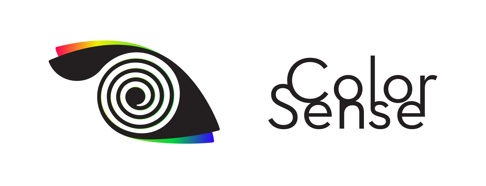

  

# Color Sense - From Concepts to Colors
Turn concepts and feelings into color combinations!

Hey girls and guys =)
This is Color Sense, a tool I've been designing for artists and designers to help them find nice colors for their visual projects. Colorful or colorless, every design is made to cause specific impressions to whoever sees it. What if you could put those impressions in words, and then turn these words into color combinations that matches the kind of feeling you're looking for? That's what I'm talking about, a color pallette made of words.

You can see it here:
https://dehciappina.github.io/Color-Sense/

BUT - let's start from the beginning:

1- One of the files of this application is from a third party, which was used to convert HEX to RGB values.
https://github.com/daniellmb/HEX-RGB-Conversion/blob/master/LICENSE.txt

    Directly from it's LICENSE file:
    * HEX <=> RGB Conversion
    * Copyright(c) 2011 Daniel Lamb <daniellmb.com>
    * MIT Licensed

3- I'm a very beginner at programming. I'm still discovering HTML and CSS, and I'm still not used to any JavaScript framework. It means that if you're willing to help me construct that, in the beginning you may have some work once you open my JS file, cause I BET there are soooo many wasted lines of code in there. I used many big arrays with many cases inside many switches that were the only way for my newbie mind to make it work. Aaalso - I don't speak english fluently.

Since I know there are many ways to improve this code, I thought about some of those improvements you could help me figure out, wich I'm still not able to resolve. My ideas are:

- Using a single function that connects the cases with the respective arrays. I think it's not that complex once you have some knowledge on this language. Since the colors combinations are made from words, there HAS to be lots ans lots of words (and color HEXs) to make this program completely useful. I was thinking if it could be more intelligent if the arrays actually were at a database file, then those thousands of words would be stored there; just a cogitation anyway.

- I don't know how to combine one word to another. With this, you could write "happy, healthy" and the code would mix the color arrays of each one of those keywords. Currently there's not a way to do that in my code.

- It would be great if you could change between RGB and CMYK color combinations. Even greater if you could see only Pantone-based colors in the pallettes. But that's a little way too high, isn't it? Maybe I got that - just show me the way.

There are so many other ways to improve this, but that's what I think this project need just now.
Thank you very much!
